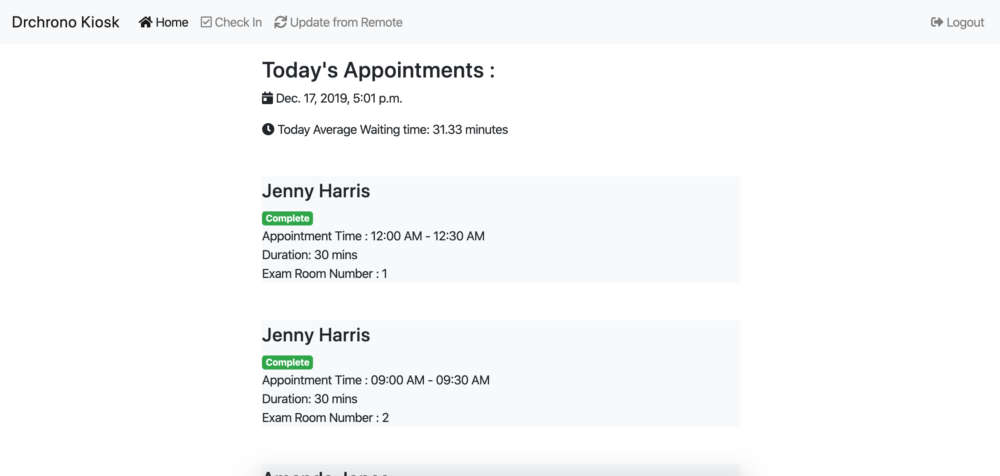
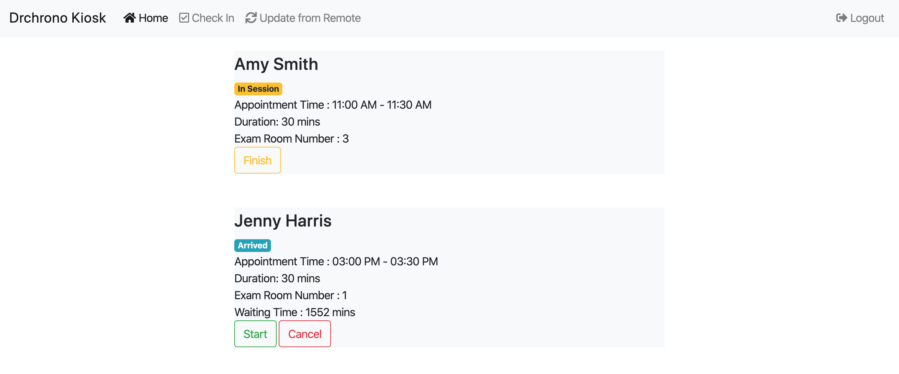
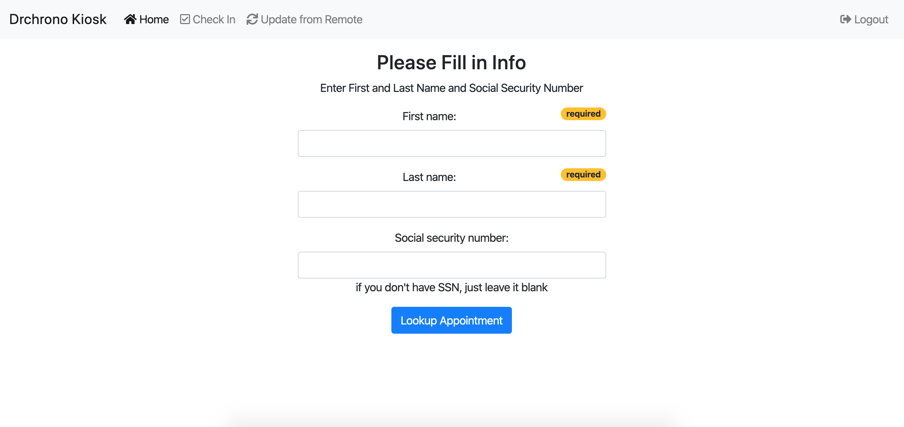
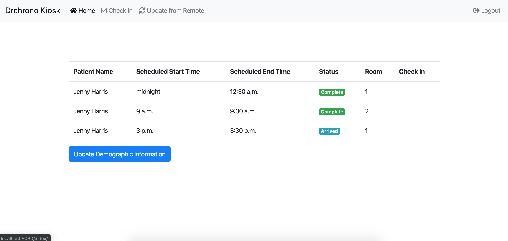
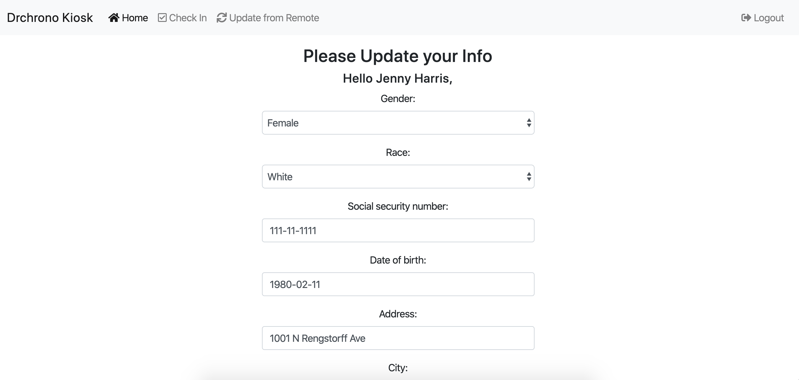

# drchrono Hackathon

### Doctor Dashboard

Imagine you’re a busy doctor running a lean medical practice. Your receptionist doesn’t have time to print out your daily schedule, 
or bother you with constant updates as patients check in, schedule new appointments, or cancel. 
You want to replace old office workflows with an interactive dashboard.

After you log into to the system, the doctor should see an interactive page they can leave open that displays today’s appointments, 
indicating which patients are scheduled, which patients have checked in, and how long they have been waiting. From this screen, the doctor 
can indicate they are seeing a patient, which stops the “time spent waiting” clock. It should be able to update when an appointment status 
changes or a new appointment is scheduled by the receptionist or patient. It should also display some summary statistics, 
like the overall average wait time for all patients they have ever seen.

Outside of these base requirements, we hope you are able to develop any features you think make sense. Put yourself in the shoes of the doctor. 
What tools would be useful if you were planning your day? We love to see creativity and initiative!


Outside of these base requirements, you are free to develop any features you think
make sense.

To begin, fork the drchrono API project repo at https://github.com/drchrono/api-example-django

We’ve built this repo to save you some set-up time! It contains a few baseline structural elements for you to build on.
It’s a great starting point, but there are probably some tweaks and improvements to be made before you continue building 
out new functionality. It doesn't quite work; it's your job to make it work, and then make it awesome!

Use the drchrono API docs and feel free to reach out to the people operations team with any questions and we'll get back
to you ASAP.


### Check-in kiosk

Before reading this please read the prompt for Doctor Dashboard, as we will be building on top of that.

Here we add a sign-in kiosk, similar to the ones you see for flight check-ins.
There should be an account association flow where a doctor can authenticate using
their drchrono account and set up the kiosk for their office.
After the doctor is logged in, a page should be displayed that lets patients check
in. A patient with an appointment should first confirm their identity (first/last
name maybe SSN) then be able to update their demographic information using the
patient chart API endpoint.  Once the they have filled out that information the
app can set the appointment status to "Arrived" (Appointment API Docs).


### Requirements
- a free [drchrono.com](https://www.drchrono.com/sign-up/) account
- [docker](https://www.docker.com/community-edition) (optional)


#### API token 
The first thing to do is get an API token from drchrono.com, and connect this local application to it!

This project has `social-auth` preconfigured for you. The `social_auth_drchrono/` contains a custom provider for
[Python Social Auth](http://python-social-auth.readthedocs.io/en/latest/) that handles OAUTH through drchrono. It should
 require only minimal configuration and tweaking. 

1) Log in to [drchrono.com](https://www.drchrono.com)
2) Go to the [API management page](https://app.drchrono.com/api-management/)
3) Make a new application
4) Copy the `SOCIAL_AUTH_CLIENT_ID` and `SOCIAL_AUTH_CLIENT_SECRET` to your `docker/environment` file.
5) Set your redirect URI to `http://localhost:8080/complete/drchrono/`


### Dev environment Setup
If you're familiar with it, docker should take care of all the dependencies for you. It will create one container with 
all the python dependencies.The project uses SQLite3 as a database back-end, so you shouldn't need to mess with anything 
to get django up and running. See `docker-compose.yml` for details.

``` 
$ git clone git@github.com:drchrono/api-example-django.git hackathon
$ docker-compose up
```

If you don't want to use docker, that's fine too! The project is fairly small and self-contained. You can probably get all
the dependencies installed and running on your favorite platform with `pip install -r requirements.txt && python manage.py runserver`. You'll have to configure the `CLIENT_ID` and `CLIENT_SECRET` variables by hand, though.

Once the dev server is running, connect with a browser to [http://localhost:8080/setup]() and use the web to authorize 
the application.


### Happy Hacking!
If you have trouble at any point in the setup process, feel free to reach out to the developer
who introduced you to the project. We try to minimize setup friction, but sometimes things go wrong, and we genuinely 
appreciate feedback about how to make things better!


### [Backend Structures](STRUCTURES.md)

### ScreenShot

1. Login Page


2. Home Page



3. CheckIn Form


4. Confirm CheckIn


5. Update Demographic

